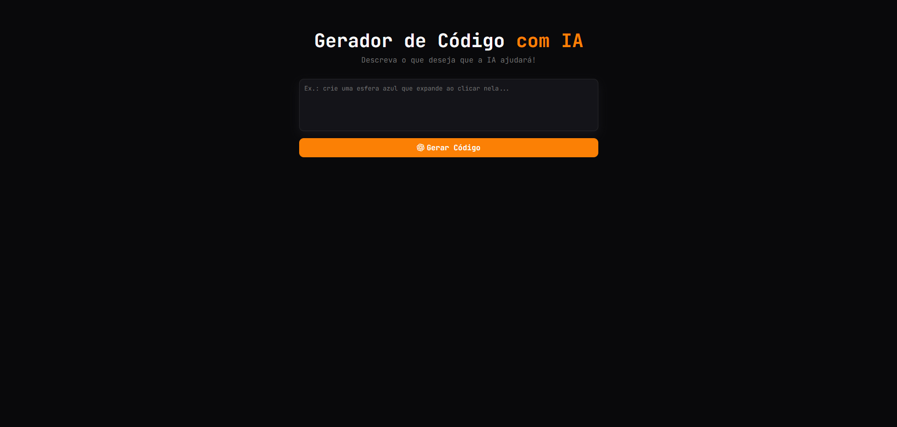
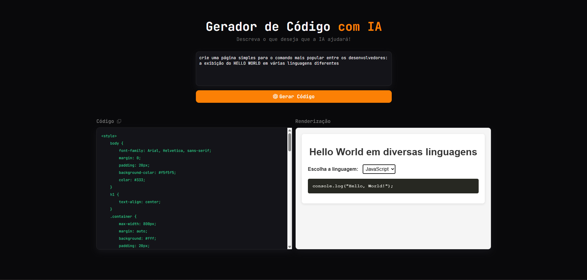

# 🚀 Code Generator - Gerador de Código com IA

Aplicação web desenvolvida com **Vite** que utiliza **Inteligência Artificial** através da **API da Groq** para transformar descrições em linguagem natural em código funcional **HTML, CSS e JavaScript**. O código gerado é exibido formatado na interface e renderizado em tempo real, permitindo visualizar imediatamente o resultado produzido pela IA.

### Status do Projeto: ✅ Concluído

<br>

## 📋 Sobre o Projeto

O **Code Generator** é uma ferramenta que permite aos usuários gerar interfaces e componentes web simples a partir de instruções textuais em linguagem natural.

A aplicação envia os prompts para a **API da Groq**, recebe o código gerado pela IA e apresenta tanto o código-fonte quanto a renderização do resultado diretamente na interface.

### Objetivo

Demonstrar a integração entre aplicações frontend modernas e modelos de Inteligência Artificial para automatizar a geração de código e acelerar o desenvolvimento de interfaces web.

### Problema Resolvido

Criar interfaces e protótipos manualmente pode consumir tempo, especialmente durante as etapas iniciais de desenvolvimento. O projeto busca reduzir esse esforço utilizando IA para gerar rapidamente estruturas simples HTML, estilos CSS e comportamentos JavaScript com base em descrições fornecidas pelo usuário.

<br>

## ✨ Funcionalidades

### Funcionalidades Implementadas

* [x] Geração automática de código com IA
* [x] Integração com a API da Groq
* [x] Suporte a HTML, CSS e JavaScript
* [x] Exibição formatada do código gerado
* [x] Renderização dinâmica em tempo real
* [x] Interface simples e intuitiva
* [x] Configuração via variáveis de ambiente
* [x] Ambiente de desenvolvimento com Vite

<br>

## 🛠️ Tecnologias Utilizadas

### Front-end


### Ferramentas


### APIs

* **Groq API**

<br>

## 🏗️ Arquitetura do Projeto

O projeto segue uma arquitetura frontend baseada em componentes e serviços, separando responsabilidades entre interface, comunicação com APIs e renderização dinâmica.

Características principais:

* Interface SPA (Single Page Application)
* Comunicação assíncrona com API REST
* Gerenciamento por módulos JavaScript
* Configuração por variáveis de ambiente
* Renderização dinâmica de conteúdo gerado

<br>

## 📂 Estrutura de Diretórios

```text
code-generator/
│
├── code-generator/
│   ├── src/                # Código-fonte da aplicação
│   │   ├── main.js         # Arquivo principal da aplicação
│   │   └── style.css       # Estilos globais
│   ├── index.html          # Estrutura base da aplicação
│   ├── .env.example        # Exemplo de configuração das variáveis de ambiente
│   └── package.json        # Dependências e scripts do projeto
│
├── docs/                   # Documentação do projeto
│   └── pages/              # Imagens das páginas do projeto
│
├── .gitignore              # Evitar versionamento de informações específicas do projeto
└── README.md    
```

<br>

## ⚙️ Pré-requisitos

Antes de iniciar, você precisará ter instalado:

* Navegador Web (Google Chrome, Brave ou Microsoft Edge)
* [Git (recomendado)](https://git-scm.com/install//windows)
* [Visual Studio Code (recomendado)](https://code.visualstudio.com/)
* [Node.js (versão 18 ou superior) + NPM](https://nodejs.org/pt-br) 
* Conta na plataforma [Groq](https://console.groq.com/)

<br>

## 🚀 Como Executar

### 1. Clonar o Repositório

```bash
git clone https://github.com/DevJoaoVitorB/code-generator.git
```

### 2. Entrar na Pasta

```bash
cd code-generator
```

### 3. Instalar Dependências

```bash
npm install
```

### 4. Criar e Fazer Login em uma Conta na Groq

Acesse o painel da Groq e realize seu cadastro e entre na plataforma utilizando sua conta cadastrada.

### 5. Gerar uma API Key

No painel:

* Acesse a seção **API Keys**
* Clique em **Create API Key**
* Copie a chave gerada

### 6. Configurar Variáveis de Ambiente

Crie o arquivo `.env` a partir do modelo disponível:

```bash
cp .env.example .env
```

No Windows:

```powershell
copy .env.example .env
```

ou

```powershell
Copy-Item .env.example .env
```

Configure suas credenciais:

```env
VITE_API_KEY=SUA_CHAVE_AQUI
VITE_API_URL=https://api.groq.com/openai/v1/chat/completions
VITE_AI_MODEL=openai/gpt-oss-120b
```

### 7. Executar o Projeto

```bash
npm run dev
```

Após a execução, acesse a URL exibida no terminal.

<br>

## 📸 Screenshots

### Tela Principal



### Código Gerado e Renderização em Tempo Real



<br>

## 👨‍💻 Autor

| **DevJoaoVitorB** |
| ----------------- |
|  |
| [](https://github.com/DevJoaoVitorB) [](https://www.linkedin.com/in/devjoaovitorb) |
